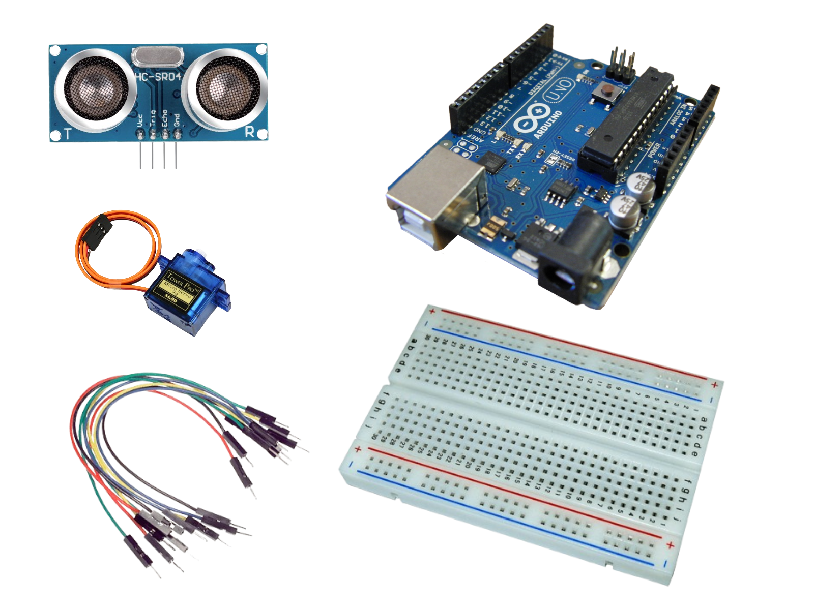
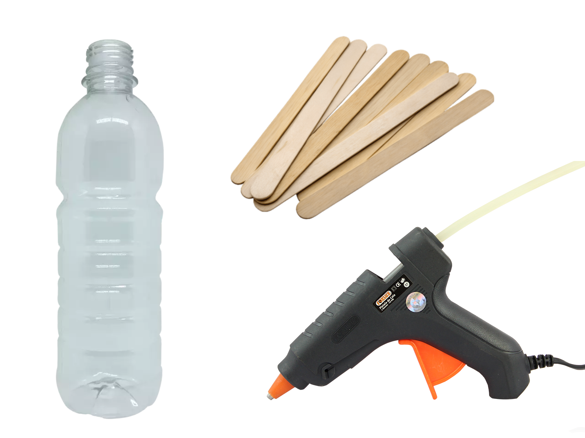
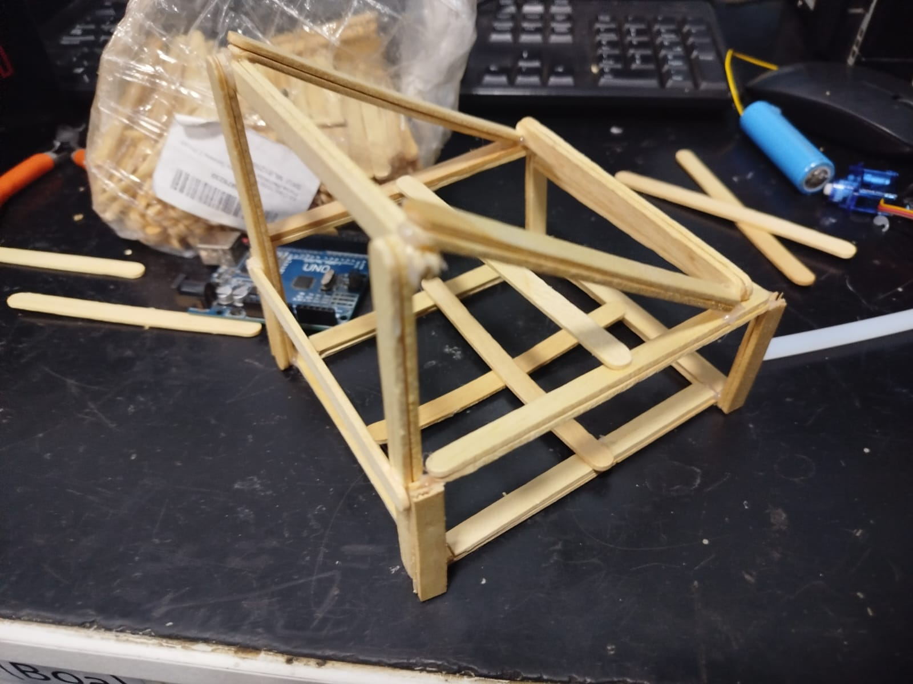

<style>
  /* 1. Remove o título "projeto-dispenser" e a descrição */
  #header_wrap h1, #header_wrap h2 {
    display: none !important;
  }

  /* 2. Mantém o botão verde com espaçamento correto */
  #header_wrap .inner {
    padding: 20px 0 !important;
  }

  /* 3. Largura total do site */
  .wrapper {
    max-width: 95% !important;
    margin: 0 auto !important;
  }

  section {
    padding: 40px 20px !important;
    width: 100% !important;
    max-width: none !important;
  }

  /* 4. Fixa todas as imagens à esquerda */
  img {
    display: block !important;
    margin-left: 0 !important;
    margin-right: auto !important;
    max-width: 100% !important;
    height: auto !important;
    clear: both !important;
    border-radius: 8px;
    margin-top: 20px !important;
    margin-bottom: 20px !important;
  }
</style>
---

# Como fazer um dispenser com sensor utilizando o Arduino 
- Arduino Uno
- Data: 08/11/2025
- Autor: Kaio Gomes

Você já pensou em ter um despenser para docinhos, alimentos ou ração de pet feito com Arduino, que é ativado com o simples ato de aproximar sua mão? Com a ajuda de um Arduino Uno, alguns palitos de picolé, um servo motor e até uma simples garrafa PET, é possível criar esse projeto divertido e útil.

<div align="center">
  <iframe width="560" height="315" src="https://www.youtube.com/embed/d7xPMEIS7oE?si=6Y3cv2Av8GlK1CJL" frameborder="0" allow="accelerometer; autoplay; clipboard-write; encrypted-media; gyroscope; picture-in-picture" allowfullscreen></iframe>
</div>

Neste tutorial, vamos mostrar os passos para a montagem do dispenser até chegar no resultado visto no vídeo, desde a estrutura inicial até a posição das peças no final.

## Material Necessário
Para começar vamos montar nosso circuito. 
Você vai precisar dos seguintes componentes e materiais:

### Componentes eletrônicos
<!-- Adiciona Imagem usando o Markdown -->


 - 1x Placa Arduino Uno
 - 1x Placa de ensaio
 - 1x Servo Motor
 - 1x Sensor HC-SR04
 - 1x Fonte de Energia
 - Alguns Jumpers


### Estrutura física
<!-- Adiciona Imagem usando o Markdown -->


- Garrafa PET: será usada como reservatório
- Cola quente: material necessário para montar a estrutura do projeto
- Palitos de picolé: estrutura e reforço do projeto

## Alimentador Automático

A lógica do funcionamento do dispenser é bem simples, ela é dividida nessas três partes:

- **Reservatório**: A garrafa PET servirá como armazenamento do conteúdo que você colocará para uso do dispenser, garantindo praticidade e baixo custo.

- **Controle de liberação**: O servo motor, acoplado à uma "tampa" feita de palitos, abre e fecha a saída da garrafa. Esse movimento libera a quantidade de ração desejada.

- **Gatilho do sistema**: Para que tudo comece, o sinal recebido vem diretamente do sensor HC-SR04, que enviará para o arduino o sinal da sua mão se aproximando, o que fará o servo motor liberar a passagem da garrafa, o mesmo sinalizará quando você afastar a mão, garantindo que o servo motor feche novamente a saída da garrafa, impedindo o disperdicio acidental.

## Montagem do hardware do dispenser
Com todos os componentes em mãos, chegou a hora de montar a parte física do seu dispenser com o Arduino Uno. O processo pode ser complicado pela montagem da base de palitos e o uso da cola quente, porém o restante é bem simples:

1. Montando a estrutura inicial do projeto
  
  - Utilize a cola quente e monte essa estrututa para segurar o projeto
  - Garanta que os palitos estão bem colados, essa parte é a base que vai segurar todo o resto

2. Complete o resto do projeto com palitos e cole a garrafa PET
  
  - Garanta que esses espaços específicos estão abertos, você os usará para organizar os componentes dentro da estrutura
  - Você pode fazer um pequeno apoio abaixo da saída da garrafa para reforçar

3. Organizando os componentes
  
  - Monte o circuito como mostrado na imagem e coloque o sensor e o servor motor nos lugares especificados
  - Conecte todos os cabos, inclusive a alimentação, usando o USB conectado no computador para enviar o código e depois pode escolher entre continuar no USB ou usar alguma alimentação externa.

## Programação do Dispenser
Agora que a parte física está montada, vamos programar o Arduino Uno para que o dispenser funcione da forma certa, seguindo a lógica explicada anteriormente.

O código segue três etapas principais:

- O sensor HC-SR04 envia um sinal e capta de volta, calculando a distância que o sinal percorreu
- Se for a distância de 10cm do sensor, o servo motor será ativado e a comporta abrirá para despejar o conteúdo na garrafa
- Quando a distância vista pelo sensor for maior que 10cm, o servo motor voltará à posição inicial, fechando a saída da garrafa.

```cpp
#include <Servo.h> //Chama a biblioteca servo

// Definição dos pinos
const int TRIG_PIN = 9;
const int ECHO_PIN = 10;
const int SERVO_PIN = 6;

// Configurações de distância e ângulos
const int DISTANCIA_GATILHO = 10; // Distância em cm para ativar
const int ANGULO_REPOUSO = 0;      // Posição inicial
const int ANGULO_ATIVADO = 90;     // Posição quando detecta algo

Servo meuServo; //Nome do servo

void setup() {
  Serial.begin(9600); //Liga a conexão serial
  
  pinMode(TRIG_PIN, OUTPUT); //Define o pino como saída
  pinMode(ECHO_PIN, INPUT); //Define o pino como entrada
  
  meuServo.attach(SERVO_PIN); //Define o pino do servo para ser usado
  meuServo.write(ANGULO_REPOUSO); // Começa na posição inicial
}

void loop() {
  //Pulso para ler o sensor
  digitalWrite(TRIG_PIN, LOW);
  delayMicroseconds(2);
  digitalWrite(TRIG_PIN, HIGH);
  delayMicroseconds(10);
  digitalWrite(TRIG_PIN, LOW);

  //Calcula a distância
  long duracao = pulseIn(ECHO_PIN, HIGH);
  int distancia = duracao * 0.034 / 2;

  // Mostra a distância no Monitor Serial 
  Serial.print("Distancia: ");
  Serial.print(distancia);
  Serial.println(" cm");

  // Lógica do movimento
  if (distancia > 0 && distancia < DISTANCIA_GATILHO) {
    // Se algo estiver perto, move o servo
    meuServo.write(ANGULO_ATIVADO);
  } else {
    // Se não tiver nada, volta para o repouso
    meuServo.write(ANGULO_REPOUSO);
  }

  delay(100); // Pequena pausa para estabilidade
}
```

## Conclusão
Neste tutorial, você aprendeu a construir um dispenser usando o Arduino Uno, palitos de picolé, uma garrafa PET e componentes de robótica.

Mais do que um projeto funcional, este dispenser é uma ótima forma de testar suas habilidades de montagem e robótica, sendo totalmente personalizável! 

Você pode começar com a versão básica e depois adicionar melhorias, como uma estrutura melhor com outros materiais, porta de saída mais resistente ou até outra forma de montagem. Cada um tem suas particularidades, e nada melhor do que adaptar a tecnologia para o seu universo.


